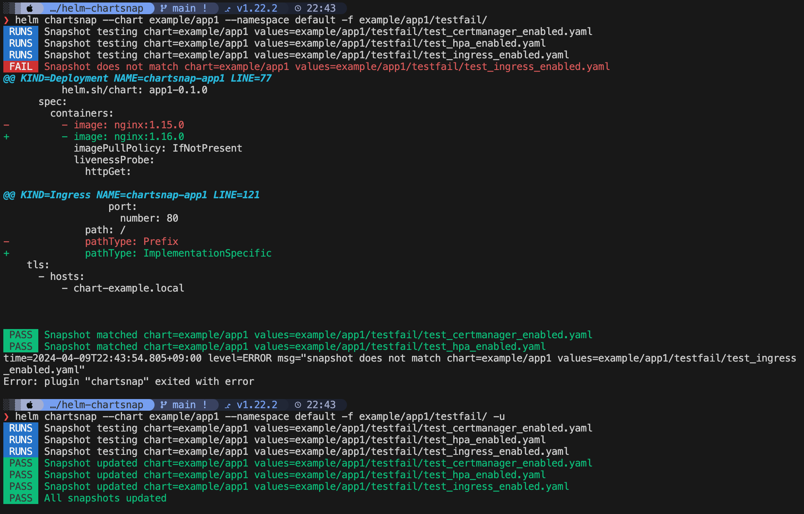

# helm-chartsnap 📸　
[](https://pkg.go.dev/github.com/jlandowner/helm-chartsnap)
[](https://goreportcard.com/report/github.com/jlandowner/helm-chartsnap)


Snapshot testing tool for Helm charts.

Bring powerful UI testing capabilities for Helm chart with minimal configuration just within `values.yaml` file. 



## Why Snapshot Testing? 📸

I believe that snapshot testing, popular testing approach in Web or UI testing with tools like Jest, is the best way to test Helm charts. Snapshot testing provides several benefits:

- **Visual comparisons:** Snapshot tests create a baseline output and then compare it to subsequent test results. This allows for easy visual inspection of changes and regressions in Helm chart rendering.

- **Enhanced maintainability:** Snapshot testing simplifies the test setup process, making it more accessible and maintainable, especially when dealing with complex Helm charts. The input for the Helm chart is a combination of values. We need only maintain the assumed input combinations(=values.yaml), and their snapshots.

- **Continuous testing:** By continuously taking snapshots of the Helm chart in your CI process, you can quickly notice the changes in your whole chart and avoid regressions.

This advantages are not limited to the Helm chart you created, but also the third-party charts you have installed on your Kubernetes if you are a Kubernetes administrator. When upgrading cluster, you can notice any changes of the output manifests produced by your *values*, no matter how minor.

## Features 🔑

* **Easy & Intuitive Snapshot testing for Helm developers**
  
  - **No tool-specific TestSuite file format**: Unlike some tools that require the creation of separate TestSuites with custom file formats, this tool doesn't require any additional file formats. Instead, you can prepare variations of the standard `values.yaml` file for each test case. This eliminates the need to learn new formats and simplifies testing.

* **Optimized for Helm chart**

  - **Handling dynamic output generated by helm functions**: You can specify additional properties within the values.yaml file for each test case to providing flexibility in adjusting test behavior. For example, you can control dynamically generated values generated helm functions like [randAlphaNum](https://helm.sh/docs/chart_template_guide/function_list/).

* **Continuous Snapshot testing**

  - **[GitHub Action](https://github.com/jlandowner/helm-chartsnap-action) is ready**: GitHub action which enables to do continuous snapshot testing for local or remote Helm charts in your CI is ready 🚀 -> [`helm-chart-action`](https://github.com/jlandowner/helm-chartsnap-action)

## Motivation

There are existing Helm testing tools which can snapshot test.
- [helm-unittest](https://github.com/helm-unittest/helm-unittest), a popular unittest tool, it has option to do [snapshot testing](https://github.com/helm-unittest/helm-unittest#snapshot-testing).
- [terratest](https://terratest.gruntwork.io/), Automated tests for your infrastructure code. It can write tests as Go codes and it has the feature to test the output of Helm. [blog post](https://blog.gruntwork.io/automated-testing-for-kubernetes-and-helm-charts-using-terratest-a4ddc4e67344)

> Helm offitial test tool [`ct`](https://github.com/helm/chart-testing) is not for unit test or snapshot test but for lint and integration test

While they are valuable tools for testing Helm charts, it has certain limitations for snapshot testing.

- You need to learn and prepare the Test Suite files of the tools even if only for snapshot testing.

- Not snapshot whole chart by default, but designed to test on a per-file basis within the Helm chart.

- Helm function's dynamic outputs are not considered.

helm-unittest is designed that it conducts tests on a per-file basis within the Helm chart. This means that it evaluates each individual file independently, and when Helm chart values or conditions lead to an entire file being conditionally included or excluded, it can result in tests being unable to cover important scenarios.

Here is an example of test spec file for snapshot testing in helm-unittest.

> https://github.com/helm-unittest/helm-unittest#snapshot-testing
> 
> ```yaml
> templates:
>   - templates/deployment.yaml
> tests:
>   - it: pod spec should match snapshot
>     asserts:
>       - matchSnapshot:
>           path: spec.template.spec
>   # or you can snapshot the whole manifest
>   - it: manifest should match snapshot
>     asserts:
>       - matchSnapshot: {}
> ```

For instance, consider a scenario where the Helm chart may create a `Certificate` resource of `cert-manager` when both TLS is enabled and cert-manager is enabled, but create a self-signed TLS `Secret` resource using helm function [`genSelfSignedCert`](https://helm.sh/docs/chart_template_guide/function_list/#genselfsignedcert) when cert-manager is not enabled. Furthermore, whether TLS is enabled or not affects Ingress's TLS properties, Deployment's app-specific TLS options, etc.

In such cases, helm-unittest may not be able to adequately test the entire chart's behavior, as the output of these conditional files may be empty, leading to incomplete tests.

However all you have to do with `helm-chartsnap` is just to prepare some `values.yaml` files of the patterns you expect　😊

## Installation 🚀

You can install as Helm plugin.

```sh
helm plugin install https://github.com/jlandowner/helm-chartsnap
```

Other options:

- Go install

  ```sh
  go install github.com/jlandowner/helm-chartsnap@latest
  ```

- [Download release binary](https://github.com/jlandowner/helm-chartsnap/releases)

## Usage

Just pass your chart for quickstart.

```
helm chartsnap -c YOUR_CHART
```

`__snapshot__` directory is created in the chart directory and `default.snap` is created.

Also you can create test cases as a variation of Values files of your chart.

Here is full usage of the command.

```sh
Usage:
  chartsnap -c CHART [flags]

Examples:

  # Snapshot with defualt values:
  chartsnap -c YOUR_CHART
  
  # Update snapshot files:
  chartsnap -c YOUR_CHART -u

  # Snapshot with test case values:
  chartsnap -c YOUR_CHART -f YOUR_TEST_VALUES_FILE
  
  # Snapshot all test cases:
  chartsnap -c YOUR_CHART -f YOUR_TEST_VALUES_FILES_DIRECTOY
  
  # Set addtional args or flags for 'helm template' command:
  chartsnap -c YOUR_CHART -f YOUR_TEST_VALUES_FILE -- --skip-tests

  # Output with no colors:
  NO_COLOR=1 chartsnap -c YOUR_CHART

Flags:
  -c, --chart string          path to the chart directory. this flag is passed to 'helm template RELEASE_NAME CHART --values VALUES' as 'CHART'
  -N, --ctx-lines int         number of lines to show in diff output. 0 for full output (default 3)
      --debug                 debug mode
      --fail-once             fail once any test case failed
  -h, --help                  help for chartsnap
      --namespace string      namespace. this flag is passed to 'helm template RELEASE_NAME CHART --values VALUES --namespace NAMESPACE' as 'NAMESPACE' (default "default")
  -o, --output-dir string     directory which is __snapshot__ directory is created. (default: values file directory if --values is set; chart directory if chart is local; else current directory)
      --release-name string   release name. this flag is passed to 'helm template RELEASE_NAME CHART --values VALUES' as 'RELEASE_NAME' (default "chartsnap")
  -u, --update-snapshot       update snapshot mode
  -f, --values string         path to a test values file or directory. if directroy is set, all test files are tested. if empty, default values are used. this flag is passed to 'helm template RELEASE_NAME CHART --values VALUES' as 'VALUES'
  -v, --version               version for chartsnap

```

## Handling dynamic values 💪

Values files can have a `testSpec` property that can detail or control the test case.

```yaml
testSpec:
  # desc is a description for the set of values
  desc: only required values and the rest is default
  # dynamicFields defines values that are dynamically generated by Helm function like 'randAlphaNum'
  # https://helm.sh/docs/chart_template_guide/function_list/#randalphanum-randalpha-randnumeric-and-randascii
  # Replace outputs with fixed values to prevent unmatched outputs at each snapshot.
  dynamicFields:
    - apiVersion: v1
      kind: Secret
      name: cosmo-auth-env
      jsonPath:
        - /data/COOKIE_HASHKEY
        - /data/COOKIE_BLOCKKEY
        - /data/COOKIE_HASHKEY
        - /data/COOKIE_SESSION_NAME

# Others can be any your chart value.
# ...
```

## Showcase & Users ✨

| Users / Projects | Description | URL |
|:---|:---|:---|
| Example | Example chart generated by `helm create` command | [`example/app1`](./example/app1) |
| Example | Example of snapshotting charts in remote Helm repositories | [`example/remote`](./example/remote) |
| [helm-chartsnap-action](https://github.com/jlandowner/helm-chartsnap-action) | GitHub action to use helm chartsnap in CI | https://github.com/jlandowner/helm-chartsnap-action |
| [cosmo-workspace](https://github.com/cosmo-workspace/cosmo) | Open source WebIDE & DevEnvironment Platform on Kubernetes | https://github.com/cosmo-workspace/cosmo/tree/main/charts/cosmo/test |


## LISENCE

MIT
